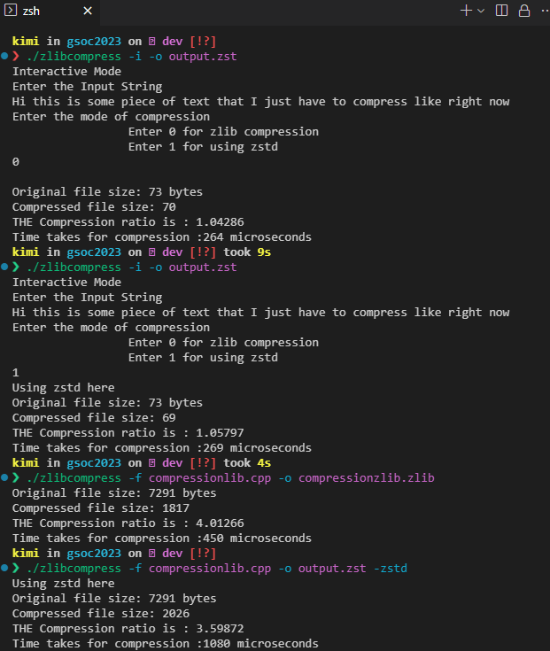

# Zlib Compression
A standalone executable in C++ that uses zlib compression to compress input strings/files.

## Prerequisites
### Linux 
`sudo apt install zlib1g-dev -y`

## Compiling  Code
### Using make
1. Clone the repo
2. `cd zlibCompression`
3. `make`

### Alternatively 
The executable can be compiled with 
`g++ main.cpp compressionlib.cpp -o zlibcompress -lz`

### Usage
1. In File Mode   
`./zlibcompress -f <INPUT_FILE> -o <OUTPUT_FILE>`  
Eg . To compress a file "example.txt" and store it in "compressed.txt" use: 
`./zlibcompress -f example.txt -o compressed.txt`
2. Interactive Mode:  
`./zlibcompress -i -o <OUTPUT_FILE>` 
Then enter a string in the terminal prompt.  
Eg . To save the compressed string in "compressed.txt" 
`./zlibcompress -i -o compressed.txt` 
---

